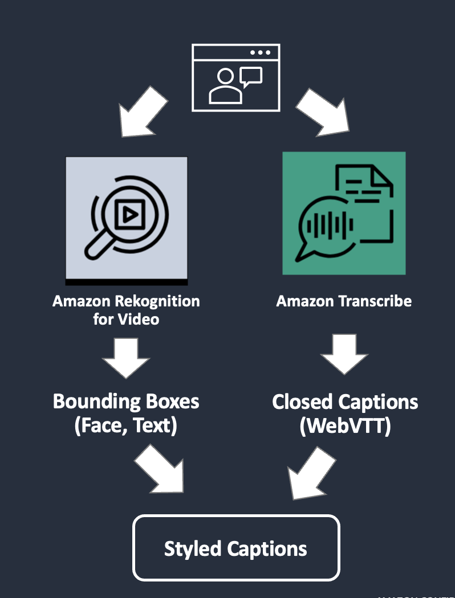

# awscdk-app-automated-caption-placement-demo

AWS CDK app for deploying the necessary resources for the automated caption placement demo

## Demo
Uploading a video file to S3 bucket triggers the following jobs:
* Extract captions from the video file's audio track using Amazon Transcribe API
* Detect faces in the video using Amazon Rekognition Face Detection API
* Detect texts in the video using Amazon Rekognition Text Detection API
* Manipulate the captions file based on the geometry information obtained from the face/text detections
* Transcode the video/captions file into HLS streams 




## Install
1. Setup [CDK](https://docs.aws.amazon.com/cdk/v2/guide/getting_started.html) environment (including Node.js, Docker)

2. Install this CDK app
```
$ git clone https://github.com/kuu/awscdk-app-automated-caption-placement-demo.git
$ cd awscdk-app-automated-caption-placement-demo
$ npm i
```

## Deploy
```
$ npx cdk deploy
```

### Resources
The following resources will be deployed:
* AWS::S3::Bucket x 2
* AWS::Lambda::Function x 5
* AWS::SNS::Topic

### Outputs
After the deployment, the following output will be printed:
* InputBucket: S3 bucket to upload the input file to
* OutputBucket: S3 bucket to store the output files
* EventBridgeRuleName: The EventBridge Rule to recieve S3 notifications and trigger the StepFunction state machine
* PlaybackUrl1: HLS playlist transcoded with the original caption
* PlaybackUrl2: HLS playlist transcoded with the styled caption

## Run
1. Upload a video file to the input S3 bucket
2. Check that the EventBridge Rule has triggered a StepFunction state machine job
3. After the job completes, play back the HLS playlist

## Cleanup
```
$ npx cdk destroy
```
